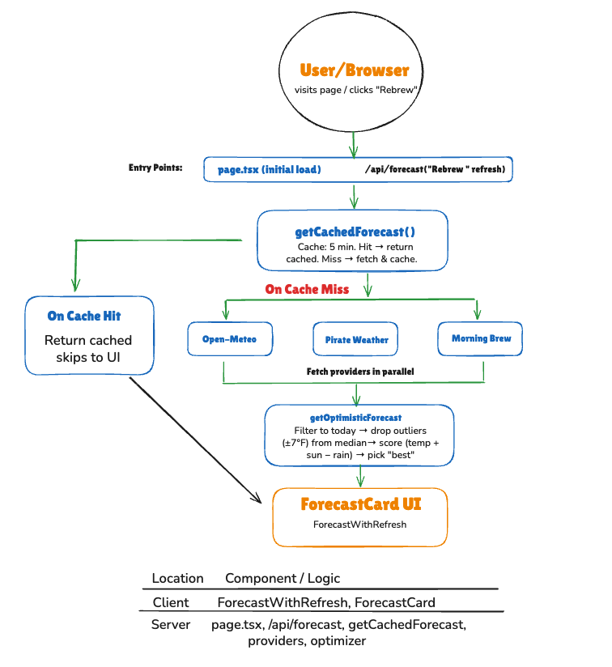

# The Bright Blend ☕️

**The Bright Blend** — formerly known as: "It’s Always Sunny in New York" is a weather app that refuses to be pessimistic. It pulls forecasts from multiple weather providers and always shows you the sunniest, warmest outlook for NYC —  regardless of reality.

## Live App

**Vercel Deployment:** [https://the-bright-blend.vercel.app/](https://the-bright-blend.vercel.app/)

---

## How It Works

### Data Flow



**Summary:** User visits the page or clicks Rebrew → `getCachedForecast()` checks a 5‑min cache → on miss, fetches from Open-Meteo, Pirate Weather, and Morning Brew in parallel → `getOptimisticForecast` filters to today, drops outliers (±7°F from median), scores (temp + sun − rain), picks best → ForecastCard UI displays the result.

### Optimistic Scoring

The app selects the "best" forecast using:

- **Temperature** — Higher is better
- **Sunny bonus** — +10 for clear or partly cloudy conditions
- **Precipitation penalty** — −0.5 × precipitationChance (lower rain chance is better)

Outlier filtering drops forecasts whose high temp is more than ±7°F from the median of all providers, so one bad provider can't cause drastic swings (e.g. 60° → 38°).

### Providers

| Provider | API | Key Required |
|----------|-----|--------------|
| Open-Meteo | [open-meteo.com](https://open-meteo.com) | No |
| Pirate Weather | [pirateweather.net](https://pirateweather.net) | Yes |
| Morning Brew | [weather-ashy-gamma-36.vercel.app](https://weather-ashy-gamma-36.vercel.app/api/forecast) | No |

---

## Getting Started

### Prerequisites

- Node.js 18+
- (Optional) A [Pirate Weather](https://pirateweather.net) API key (free) — app works with 2 providers without it

### Setup

1. Clone the repo and install dependencies:

```bash
git clone https://github.com/PhyPhy07/the-bright-blend.git
cd the-bright-blend
npm install
```

2. Copy `.env.example` to `.env.local` and add your Pirate Weather API key (optional; app runs with Open-Meteo + Morning Brew if omitted):

```bash
cp .env.example .env.local
```

Edit `.env.local` and add your key:
```
PIRATE_WEATHER_API_KEY=your_key_here
MORNING_BREW_API_URL=https://weather-ashy-gamma-36.vercel.app/api/forecast
```

3. Run the development server:

```bash
npm run dev
```

4. Open [http://localhost:3000](http://localhost:3000)

5. Run tests (optional):

```bash
npm test
```

---

## Tech Stack

- **Framework:** Next.js 15 (App Router)
- **Styling:** Tailwind CSS
- **Deployment:** Vercel

---

## Architecture

- **Provider registry** — Single source of truth for weather providers; add new providers by implementing the `WeatherProvider` interface and registering in `getProviders()`
- **Normalized types** — `NormalizedForecast` and `ForecastDay` ensure consistency across providers
- **Optimizer** — Pluggable scoring logic for selecting the "best" forecast

### Project Structure

| Path | Purpose |
|------|---------|
| `src/app/page.tsx` | Server component; fetches forecast, passes to client |
| `src/app/api/forecast/route.ts` | API route for Rebrew refresh |
| `src/lib/fetchForecast.ts` | Cached fetch orchestration (5 min TTL) |
| `src/lib/optimizer.ts` | Picks best forecast (filter → outliers → score) |
| `src/lib/providers/` | Provider implementations + registry |
| `src/components/` | ForecastWithRefresh (client), ForecastCard (UI) |

## Future Scalability

Upon future iterations of this application, I would consider implementing:

### Caching & Performance

- Shared cache (e.g. Redis) when running multiple instances so cache hits work across instances
- Rate limiting on the API to avoid abuse and stay within provider limits

### Providers & Data

- **Searchable locations:** Add a search input, geocode to lat/lon, pass into `getCachedForecast(lat, lon)`, include location in cache key; Open-Meteo and Pirate Weather support any coordinates, Morning Brew stays NYC-only
- **Adding more providers:** Implement the `WeatherProvider` interface, register in `getProviders()`; no changes needed in optimizer or UI
- Search by zip code
- 10-day weather outlook option, comparable views option
- More fields to blend in the formula (e.g. wind, humidity) for favorable weather
- Configurable optimizer (scoring weights, outlier threshold) without code changes
- Runtime validation (e.g. Zod) for API responses when exposing externally

### UX & Accessibility

- Mobile view
- Screen reader support and dynamic updates for screen readers
- Dark mode

### User Preferences

- Save recent searches
- Personal greetings
- Optional email notifications for catastrophic weather in saved areas (freezes, snow storms, hurricanes) or supplemental email with newsletter

### Observability

- Logging and error tracking (e.g. Sentry)
- Metrics (which provider wins most often, failure rates)
- Monitoring/alerting for provider failures in dev communication channels

### Flexibility

- API versioning if the public API shape changes over time

---

*🤠Dan Toomey is my hero.☀️*
