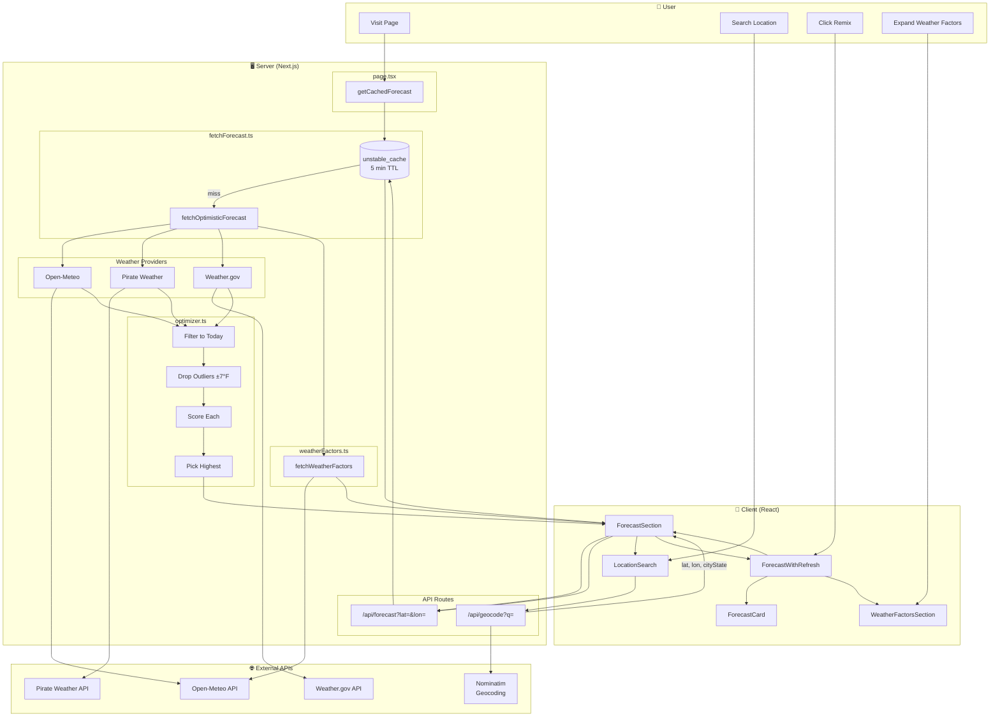
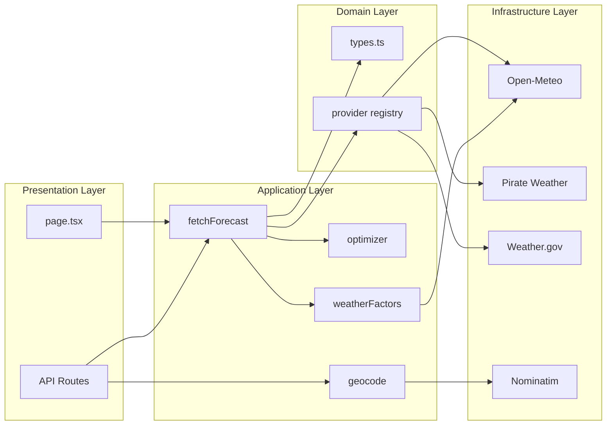
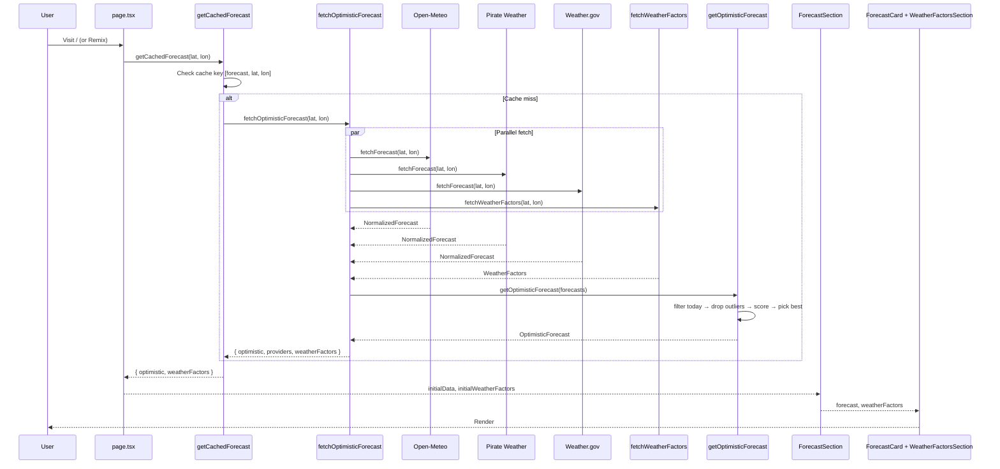
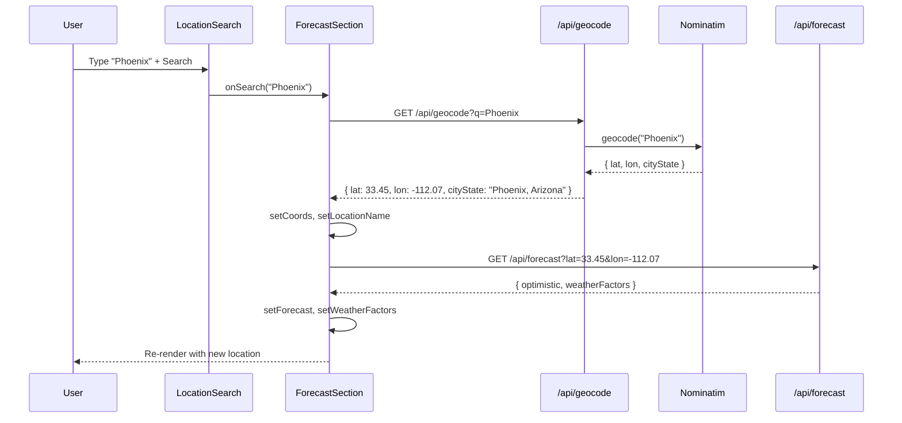
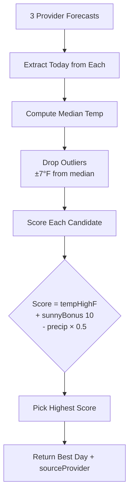
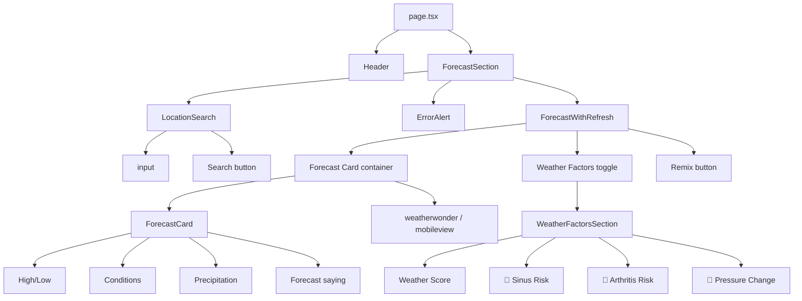

# Weather Wonder — Data Flow & Architecture

## Full System Diagram

## Architecture Layers

## Data Flow Sequence

## Location Search Flow

## Optimizer Logic

## Component Hierarchy

## File Map

| File | Role |
|------|------|
| `src/app/page.tsx` | Server entry; fetches initial forecast (NYC), passes to ForecastSection |
| `src/app/api/forecast/route.ts` | GET handler; parses lat/lon, returns cached forecast + factors |
| `src/app/api/geocode/route.ts` | GET handler; geocodes query to lat, lon, cityState |
| `src/lib/fetchForecast.ts` | Orchestrates providers + weather factors; wraps in unstable_cache |
| `src/lib/optimizer.ts` | Filters to today, drops outliers, scores, picks best forecast |
| `src/lib/utils/weatherFactors.ts` | Fetches pressure/humidity/wind from Open-Meteo; computes risks |
| `src/lib/utils/geocode.ts` | Calls Nominatim; returns lat, lon, cityState |
| `src/lib/providers/registry.ts` | Returns [Open-Meteo, Pirate Weather, Weather.gov] |
| `src/lib/providers/openMeteo.ts` | Fetches from Open-Meteo, normalizes to ForecastDay |
| `src/lib/providers/pirateWeather.ts` | Fetches from Pirate Weather, normalizes |
| `src/lib/providers/weatherGov.ts` | Fetches from Weather.gov (points → forecast), normalizes |
| `src/components/ForecastSection.tsx` | Client; owns forecast/coords state; search + refresh handlers |
| `src/components/ForecastWithRefresh.tsx` | Renders ForecastCard, WeatherFactors toggle, Remix button |
| `src/components/ForecastCard.tsx` | Displays today's forecast (temp, conditions, saying) |
| `src/components/WeatherFactorsSection.tsx` | Displays score, sinus/arthritis risk, pressure change |
| `src/components/LocationSearch.tsx` | Search input + button; calls onSearch |
